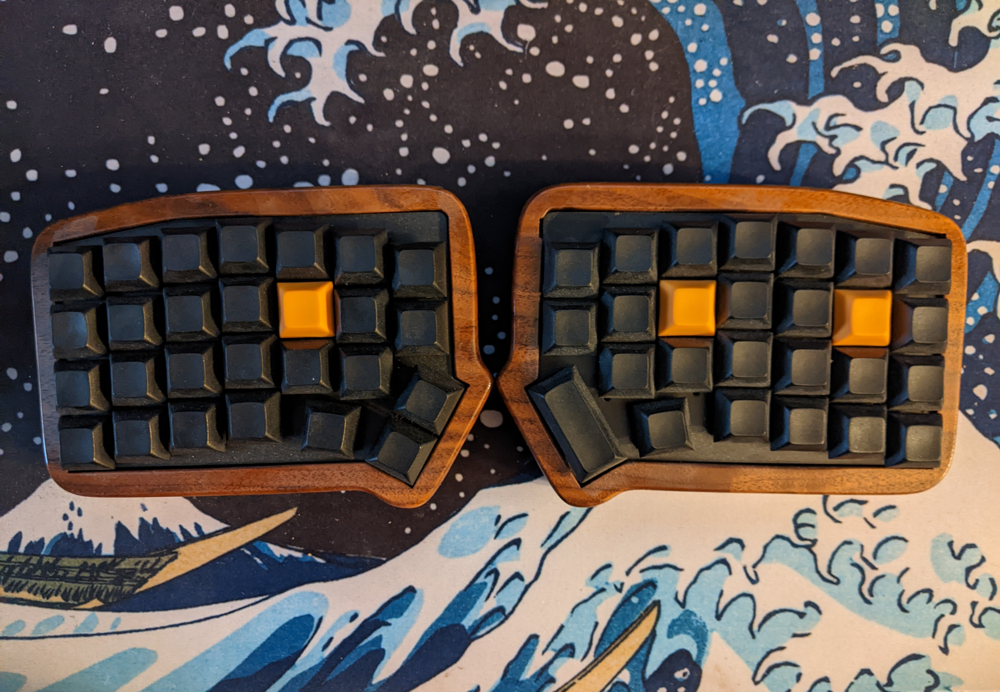

The ErgoTravel was my first foray into the world of ergonomic keyboards. For this first build, I stuck with something tried and true. I purchased a kit from an online retailer, and built it according to the instructions. While the components were all included, I had to solder everything by hand, my first major experience with soldering. It was a lot of fun.

Once I had everything soldered and assembled, the next step was firmware. The keyboard runs QMK, a C-based firmware framework that runs on hundreds of keyboard designs, including the ErgoTravel. The main config, describing the electrical design, was already complete, but I had to create and tweak my own keymap. The keymap determines what pressing a given key actually does. I decided to get ambitious and try out as many of QMKs features as possible, including tap dances, layers, layer-taps, and leader key. It was great to explore the firmware and learn a bit of C.

Once I had built the keyboard and been using it for a few weeks, a small problem became apparent: the kit didn't come with a full case, so the PCB was partially exposed. I was slowly noticing dust and gunk accumulating, which I thought could become an issue long term. So I wanted to create a more full enclosure. Luckily, my father is a hobbyist wood-worker, so we worked together create a case of walnut. It's beautiful, I think.