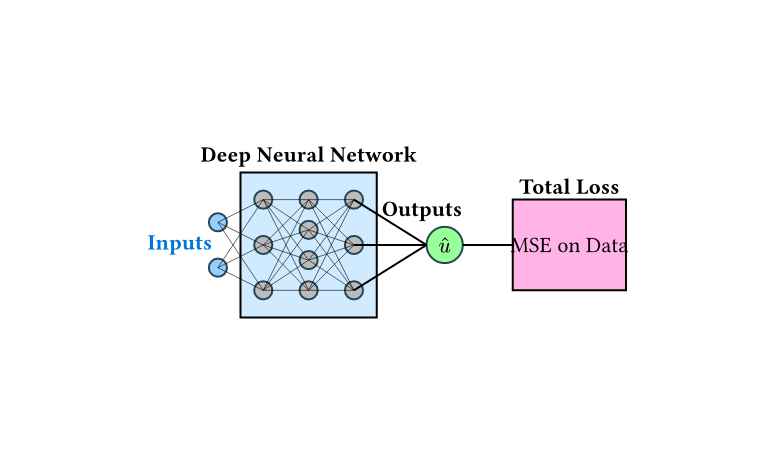
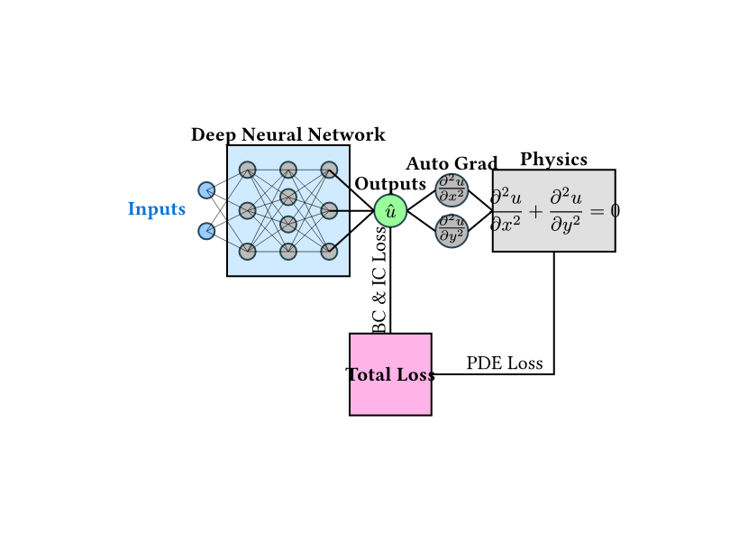
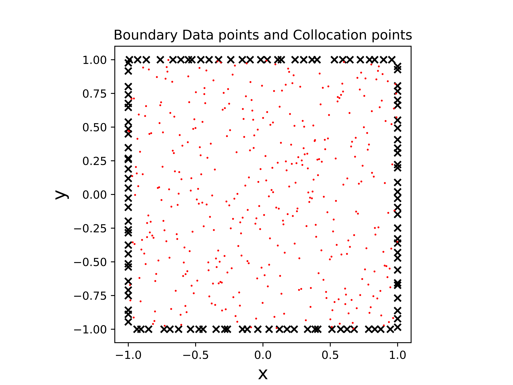
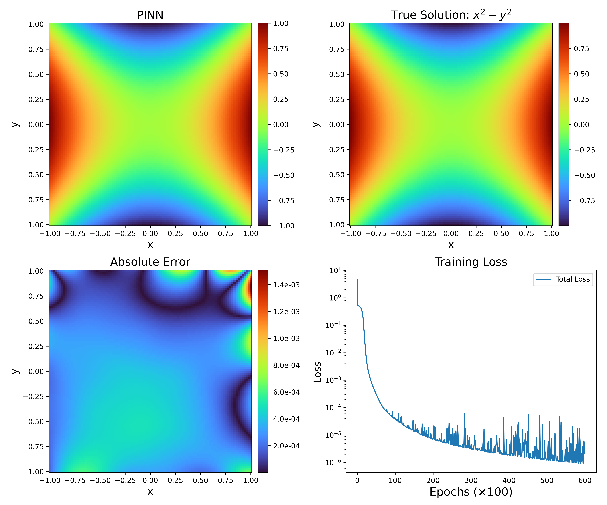
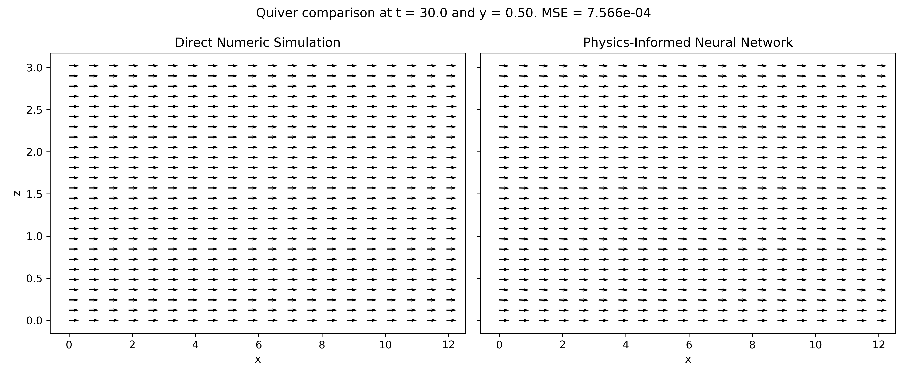
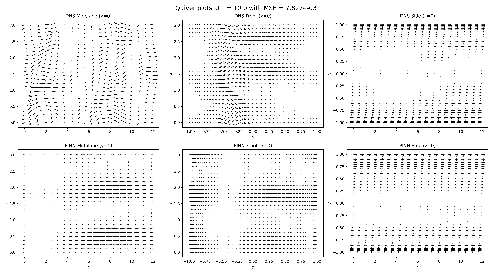

# Physics-Informed Neural Networks for Fluid Dynamics

## Abstract

Physics-informed neural networks (PINNs) are a class of machine learning models that seek to model physical phenomena by augmenting the architecture with the governing equations. In this paper, we first introduce the structure of these networks and provide an example of how you would approach a sample problem using a PINN. Then, we apply the architecture to the problem of Plane Couette flow in fluid dynamics.

---

# Introduction

Physics‑informed neural networks have been extensively used in physics and fluid dynamics to model many different kinds of flow. Before exploring this complex application, we begin with a review of the basics of physics‑informed neural networks and neural networks in general.

## Neural Networks

A neural network is a machine‑learning model meant to mimic the basic structure of brains. They are structured as a network of nodes, each akin to a neuron in the brain, that has connections (like synapses) to other nodes. These neurons are conventionally divided into layers, with data flowing from one layer to the next to slowly transform the input into an output. This procedure is called feed‑forward control. The strength of the signal between each neuron is what is learned by the model – weights determine these signals. The process of learning weights is referred to as training the network, which happens by using available data and allowing the network to adjust its internal parameters to minimize the difference between predicted and actual output values. Once trained, the network can be used to predict an outcome from previously unseen input data.

The advantage of neural networks is that they are inherently very nonlinear and complex, and they can learn patterns in data that are unclear even to human observers. In the context of modelling turbulent fluid dynamics, this is a very appealing technique since fluid flows have local complexities and nonlinear behaviour that can be difficult to model with conventional techniques. However, applying neural networks directly to physics problems presents two main issues: (i) accounting for physical constraints like conservation of mass and energy, and (ii) managing small or non‑existent data sets. Physics‑informed neural networks offer a possible solution.

---

## Physics-Informed Neural Networks

Physics‑informed neural networks (PINNs) are a class of models that seek to minimize the error between a model’s prediction and a governing equation evaluated at various points within a domain. They often use boundary conditions to further constrain the solution. The main feature of PINNs is minimizing the residual of the equation at a predefined set of data points known as collocation points.

PINNs, introduced in their modern form by Raissi et al., are motivated by the fact that physics problems come with a vast amount of information about how a solution must behave. This information can be used to augment limited data sets. The loss function is the traditional mean‑squared error, augmented with an additional term that penalizes the PDE residual at each collocation point.

### Mathematical Formulation

The problems that PINNs solve are often expressed as a partial differential equation of the form:

$$
u_t + \mathcal{N}(u) = 0, \quad x \in \Omega, \quad t \in [0, T] 
$$

Here, $u(t, x)$ is the solution and $\mathcal{N}$ is a nonlinear differential operator. The total error is the sum of the mean squared error on the data and the mean squared error on the physics-informed residual:

$$ 
\text{MSE} = \text{MSE}_{u} + \text{MSE}_{f} 
$$

where $\text{MSE}_{u}$ is evaluated on the known training data and $\text{MSE}_{f}$ is evaluated on the set of collocation points. These terms can be weighted depending on the importance of the collocation points relative to the known data. For fluid dynamics problems, it's common to further split the PDE loss into terms for collocation points, boundary conditions, and initial conditions.

---

# The Laplace Equation

As a classic example, we consider the Laplace equation, a fundamental PDE in physics that appears in heat transfer, electrostatics, and fluid dynamics. In Cartesian coordinates, it is stated as:

$$ 
\frac{\partial^2 u}{\partial x^2} + \frac{\partial^2 u}{\partial y^2} = 0 
$$

We analyze this equation on the domain $\Omega = [-1, 1] \times [-1, 1]$ with the boundary condition $u(x, y) := x^2 - y^2$. The loss function is the sum of the loss on the boundary conditions ($\mathcal{L}_{\text{BC}}$) and the loss on the PDE ($\mathcal{L}_{\text{PDE}}$). We used a Latin Hypercube sampling algorithm to select 120 points on the boundary and 400 collocation points on the interior of the domain.

Our neural network for this problem consists of 5 hidden layers with 20 neurons each, trained for 60,000 epochs using the ADAM optimizer with a learning rate of $2 \times 10^{-4}$.

## Results

With this architecture, we successfully reproduced the analytic solution to Laplace's equation. The results demonstrate a proof-of-concept for PINNs before tackling more complex fluid dynamics problems.

---

# Plane Couette Flow

We next apply PINNs to predict Plane Couette flow, where a fluid is contained between two plates moving in opposite directions. This flow is governed by the Navier-Stokes equations. The goal is to predict the fluid's flow at a future time based on an initial condition. While traditional direct numerical simulation (DNS) is computationally intensive, a trained neural network can make predictions very quickly.

## Methods

We used high-resolution DNS to generate data for initial conditions and for comparison. The neural network consists of five fully connected layers of 64 neurons. It was trained using the ADAM optimizer, with 20,000 collocation points and 2,000 boundary condition points at each epoch.

## Laminar Flow

For the simple case of laminar flow, the PINN successfully reproduced the linear velocity profile with a mean-squared error on the order of $10^{-4}$.

## Turbulent Flow

For the more complex case of turbulent flow, which arises from non-zero initial conditions, the PINN was unable to accurately reproduce the results of the DNS. While the model captured the general pattern, it lost the fine-scale details characteristic of turbulence. This may be because the overall loss was low even without learning these details, suggesting a different optimizer might be beneficial.

---

# Conclusions and Future Work

This work demonstrated that PINNs can accurately solve known analytic solutions like the Laplace equation and reproduce simple laminar fluid flows by embedding the governing PDEs into the training process. However, for turbulent Couette flow, the PINN struggled to capture fine-scale eddies.

Future work could explore several avenues to enhance performance, such as using convolutional networks to better capture local patterns, employing more advanced optimizers, or simply using larger networks. With these advances, PINNs may become a competitive tool for real-world computational fluid dynamics applications.