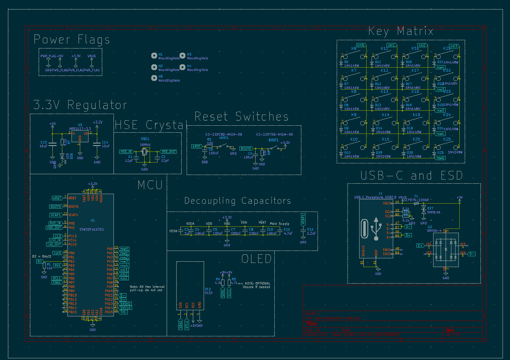
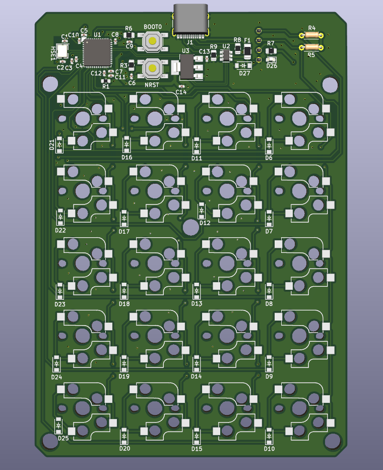
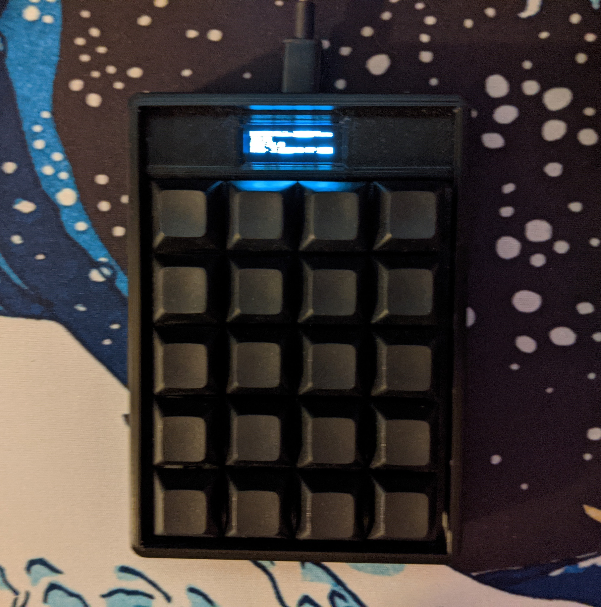

## Introduction

I had just finished a written math assignment when I thought to myself: _why should I have to compute something on my calculator, then enter it into the computer? Why isn't the calculator directly connected to my computer?_ So I decided to try and solve that problem by making a numpad and calculator in one. You activate calculate mode, input your calculation, and it writes out the answer. Here's a quick feature overview:

*   Fully Programmable with QMK firmware
*   Custom PCB with onboard Cortex M4 Microprocessor
*   Integrated 128x32 OLED
*   USB-C Connection
*   4x5 Mechanical Key Matrix for 20 Keys

The project has two main parts: Hardware (PCB and case) and software (actual functionality).

## Hardware Development

### Circuitry

The microprocessor (i.e. the brain) is integrated directly into a custom PCB, along with USB circuitry, the key matrix, and a voltage regulator. The MCU runs on an external 16MHz crystal. I designed the PCB using KiCad, a free and open source CAD suite for electrical engineering. PCB development is one of my favorite parts of these keyboard projects, because its the right mix of creativity, problem solving, and research. For this board in particular I spent a lot of time reading about the STM32F4xx series and the best design practices for PCBs. Here's the final schematic:

And the PCB Layout:

I had the PCB manufactured and some of the surface mount soldering done by JLCPCB.

### Case Design

Once I had a designed the PCB, I needed somewhere to put it. A few months prior I had purchased a 3D printer, so I decided to design and 3D print a case. I created the enclosure in AutoDesk Fusion 360\. I tried my hand at creating a screw-less design. The stackup involves three parts:

*   The main plate
*   The PCB
*   The bottom plate

The PCB is attached to the main plate by the tension between the mechanical switches (which snap into the plate) and the holes in the PCB. The bottom plate then has a "snap-fit" to attach to the main plate, fulling enclosing the PCB. Overall, I think it was pretty successful.

## Software Development

This ended up being where the bulk of my time on this project went. It turns out that programming a calculator isn't as easy as I thought! It turned out to be a great learning experience. At the start of this project I didn't really have much experience with C programming, but I developed a lot of skills by programming Icarus. The base for the firmware is the wonderful [Quantum Mechanical Keyboard Firmware](https://github.com/qmk/qmk_firmware), or QMK. It has a lot of abstraction that makes it easy to get started with your own firmware. Each keyboard has a config that defines its electrical configuration and layout, and then each user can create their own keymaps, with a specific layout to fit them. I assumed that setting up the initial config would be the easy part (as it had been with my previous boards), but I was quickly proved wrong. The first time I plugged in the PCB and flashed it with firmware that I thought was correct, the entire thing hung and became non-responsive. I spent hours debugging before eventually discovering that the quartz clock that I had chosen for the microcontroller was not the same speed as the QMK default. Once I fixed that, it was on to programming the calculator functionality.

While most normal inputs are easy to setup in QMK, I had to program the calculator functionality mostly from scratch. The way I tackled this was to create a togglable layer with custom defined keycodes corresponding to each matrix position. In other words, I defined functions for each key. Most of these functions write to a char array representing the current equation. The "=" button then calls a function from the [TinyExpr library](https://github.com/codeplea/tinyexpr) to interpret that buffer into a numeric result, if possible. Pressing enter then sends it to the computer using the qmk "send_string()" function.

To make this all more user-friendly, I added a little 128x32 OLED that displays the current expression buffer and expected result as you enter in characters. On the default layer, where you just enter numbers like a numpad, it displays the layout because my keycaps are blank.

## Final Product

