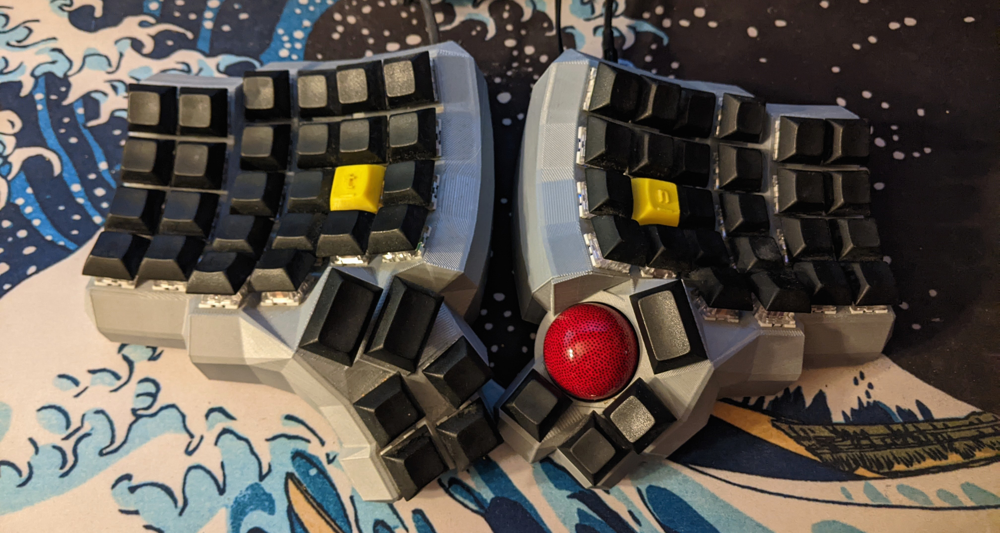

Preface: This design is entirely made by QQurn, and details can be found at [https://gitlab.com/keyboards1/dm_r_track.](https://gitlab.com/keyboards1/dm_r_track)

After building my first ergonomic keyboard a few months prior, I wanted to do more electronics. I started toying with the idea of having a pointing device (something to move the mouse) integrated into the keyboard. In researching that idea, I stumbled upon an [amazing design](https://gitlab.com/keyboards1/dm_r_track). Here are some of the key features:

*   Split Keyboard, 5x6 layout for 62 keys
*   PMW3360 Motion Sensor Integrated under the right thumb for Trackball
*   I^2C Communciation Between the Halves over RJ9
*   Arduino Micro on the Right, Pro Micro on the Left
*   Fully programmable with 32kB of flash

I was enthralled, but the only way to make one was with a 3D Printer. So I purchased a 3D Printer over the holidays, and got to work setting it up. After honing in the printer, I fired it up to create the case. But that was just the beginning of the work. The shape is molded to the human hand to minimize movement and maximize comfort, which requires a 3D "keywell," curving the keys to the fingers. This shape prevents standard printed circuit boards, which are rigid and planar.

So, QQurn's design resorts to "handwiring," where the switches are connected by dozens of individual short wires soldered in air. To make matters worse, switch matrices require a diode on each key ([see here for why](https://docs.qmk.fm/#/how_a_matrix_works)). You have to solder each wire in air, totaling over 200 connections. It is very tedious.

So, painfully, over about 20 hours, I wired all the switches, along with an I^2C bus to communicate between the two microcontrollers, and the trackball sensor. A few hours of troubleshooting and a lot of firmware tweaking later, and I have an absolutely amazing keyboard. You really can't understand how comfortable it is until you use it for a full work day, but it was definitely worth the time, money, and effort. Now for the fun part: Photos!

 

### What Did I Learn?

While I didn't create this design myself, there was still a lot of work involved in manufacturing and wiring it. I learned a ton about 3D printing, soldering, and also the QMK firmware framework which enables the keyboard to work.
