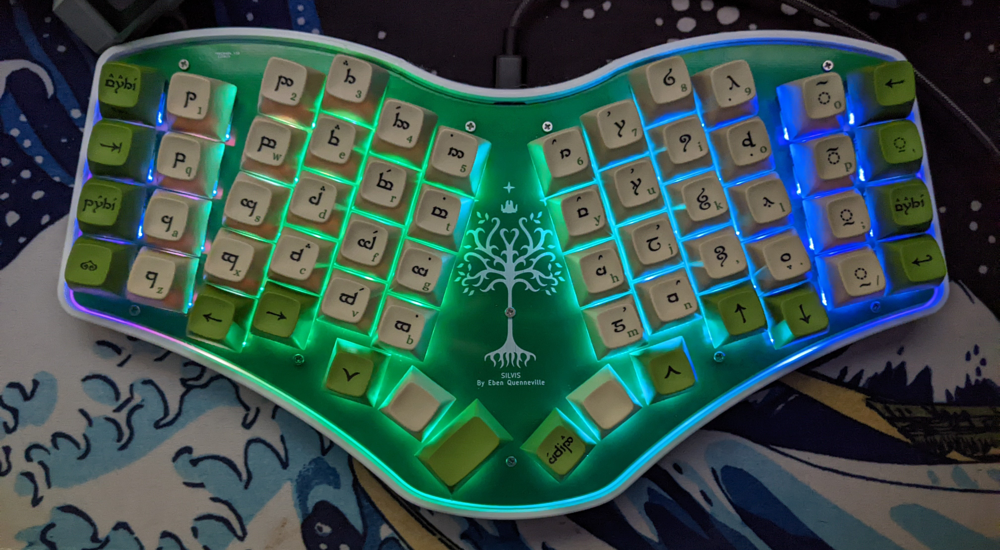

## Introduction

After building [Tantalus](/keyboards/tantalus) and another Dactyl Manuform 5x6, I still wasn't fully satisfied with my secondary keyboard. My [Dactyl Manuform R-Track](/keyboards/r_track) is perfect for my primary setup, but I have been moving around more and doing school work on a laptop. Unfortunately the Dactyl is quite bulky and a little finicky (owing to my amateur soldering job), so it isn't very mobile.

I began toying around with ideas for a while. I finally settled on creating another flat keyboard. There would be no mousing device, no curved keywells. I wanted to prioritize the typing experience, above other luxuries. I figure it is better to make the best portable keyboard possible than a mediocre mouse and mediocre keyboard. So from that came Silvis.

## Feature List

*   Custom PCB with On-board STM32F411 microcontroller
*   3D Printed Case designed in Fusion 360
*   Programmable with QMK
*   Addressable Per-Key RGB
*   USB-C
*   Hotswappable Cherry MX keys

## Hardware Development

### PCB

I designed the Silvis PCB using the KiCad suite, which I'm now pretty adept with. The PCB features an STM32F411 microcontroller, which has 512 Kb of flash and 128 Kb of ram, plenty for a keyboard. The schematic is overall similar to one of my previous projects, [Icarus](/keyboards/icarus), because I chose the same MCU for both. The biggest difference is that Silvis features per-key SK6812 Mini-E LEDs, which are reversed mounted. This means that you solder them on the back, but they point up through a hole illuminating the keys from below.

Laying out the components for this PCB proved far more challenging then any of my previous designs. I wanted the design to be symmetric but unibody, with a couple of different angles between columns to match the splay of my hand. Additionally, each and every one of the 58 keys has both an LED and a diode ([see here for why](https://github.com/qmk/qmk_firmware/blob/master/docs/how_a_matrix_works.md)) attached to it. Placing that all by hand was... daunting. I knew I would make a mistake. So I started looking into ways to do it programmatically instead.

#### ErgoGen

Ergogen, short for ergonomic keyboard generator, is a Javascript project that allows you to describe a 2D keyboard layout using a YAML config, and then generate design files, including plate SVGs, PCBs, and even cases, from there. This allows for a much faster workflow, by tweaking code instead of manually shifting keys in KiCad. I used ErgoGen to place the switches, diodes, and LEDs for the Silvis matrix. I'm a huge fan of this project, and strongly suggest it to anyone looking to make their own ergonomic keyboard.

### Case Design

I wanted Silvis to be able to hold up to abuse. I wanted a rigid case with a durable design. Of course, for those purposes, a 3D printed case probably wasn't my best choice, but its what I had to work with.

The overall design is pretty simple. I have a 3d-printed shell that the PCB drops down into, then a FR4 plate goes over that, with 10 M3 screws holding everything together. I designed all of this in Fusion360.

## Software Development

Software for this project was really easy. Over my past keyboard projects I have developed a strong understanding of QMK, so that is what I chose to use again. The only tricky part was configuring the LEDs to work properly.

## Usage

I've now been using Silvis as my daily driver for about 6 months, and it is wonderful. All of my tedious design work really did pay off.