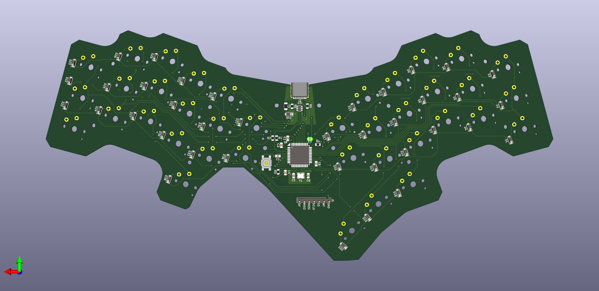
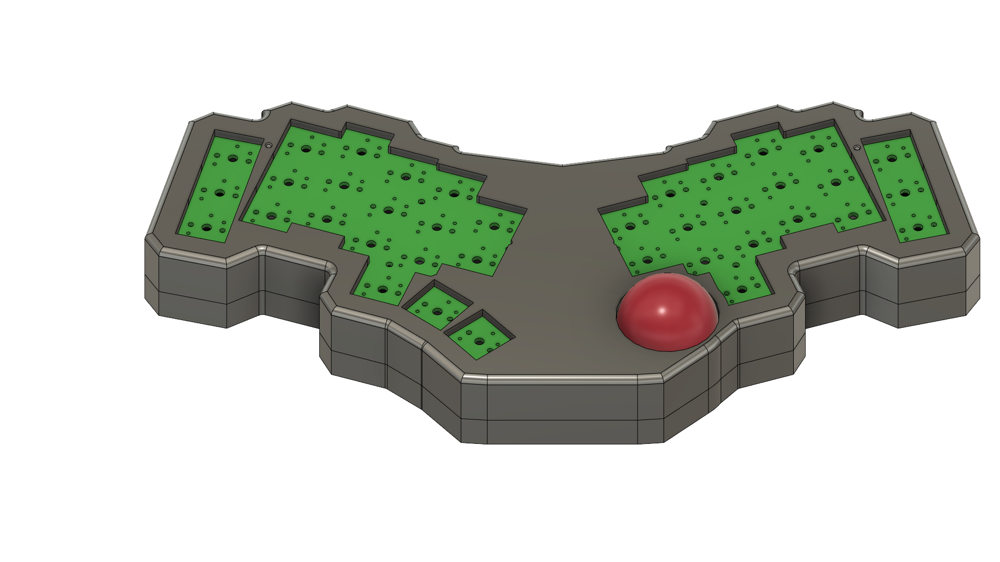
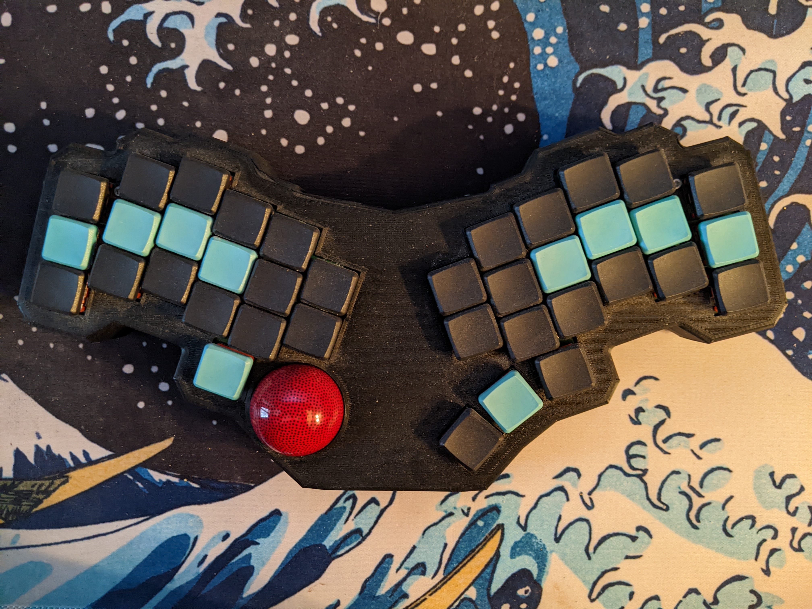
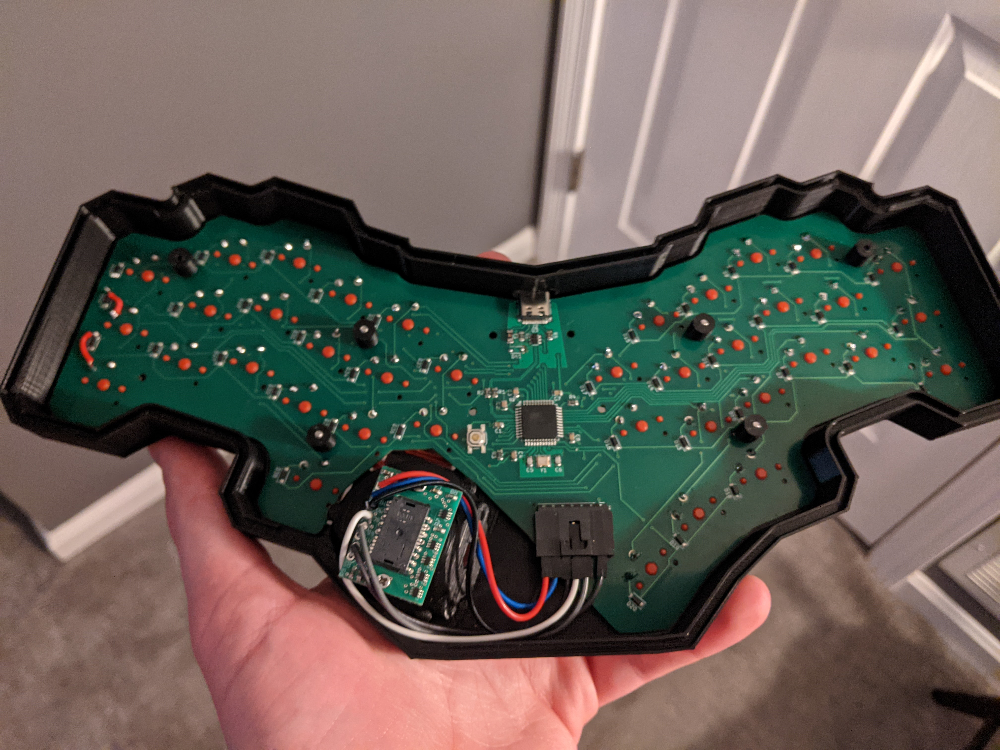

## Introduction

This is my 3rd ergo keyboard, and my first completly custom design from scratch. My previous build, the [Dactyl Manuform R Track](/keyboards/r_track), was almost perfect. However I needed another board for my second setup, and really didn't want to handwire again. So, I set about learning how to design my own 3d models and create my own PCBs. I had a couple goals in mind:

*   Fully Programmable with QMK
*   38 Choc Keys with a layout optimized for prose
*   Custom PCB with integrated MCU
*   USB-C Connection
*   Trackball on a daughterboard

I achieved most of these goals, but in practice it isn't perfect.

## Hardware Development

This project was a great learning experience for a number of reasons, but the big one is that I got very acquainted with KiCAD, an open source PCB design tool. From scratch, I learned how to create schematics, modify and design footprints, layout a PCB, route a PCB, and read datasheets. Since this was my first design, I kept it somewhat simple. No LEDs, no OLED, no split board, none of the other possible bells and whistles for QMK boards.

Instead of using a separate daughterboard for the microcontroller as I had on my previous two builds, Tantalus has an ATMEGA32U4 directly on the PCB, along with all of the clock and voltage regulating circuity that entails. This enables me to have a USB-C connection anywhere else on the PCB.

And the PCB Layout:

Once I finished the PCB, I set to work learning another tool from the ground up: AutoDesk Fusion 360\. I needed to create a 3d printable enclosure for the PCB, with a spot for the trackball. I severely underestimated how hard it'd be. After many, many iterations, here is a render of the final design:

## Assembly

I had the PCB manufactured and partially soldered by JLCPCB. Once I had soldered the rest of the components and printed the case, it came time to assemble everything. Unfortunately, everything didn't go to plan. Some of the tolerances on the case were bad, the wiring was tight, and the trackball sensor interefered with the case closing. Additionally, I made a couple small mistakes on the PCB that rendered two keys non-functional, until I ran jumper wires to fix it. However, with a bit of gumption and a dremel, I was eventually able to get everything fitting and the case to close.

## **Final Product**

Without further adue, here is how it turned out:

And the internals:

Is it janky? Yes. Did I make mistakes? Yes. Am I happy with the final product? Not really. Am I glad I did it? Absolutely. This was a great learning experience.