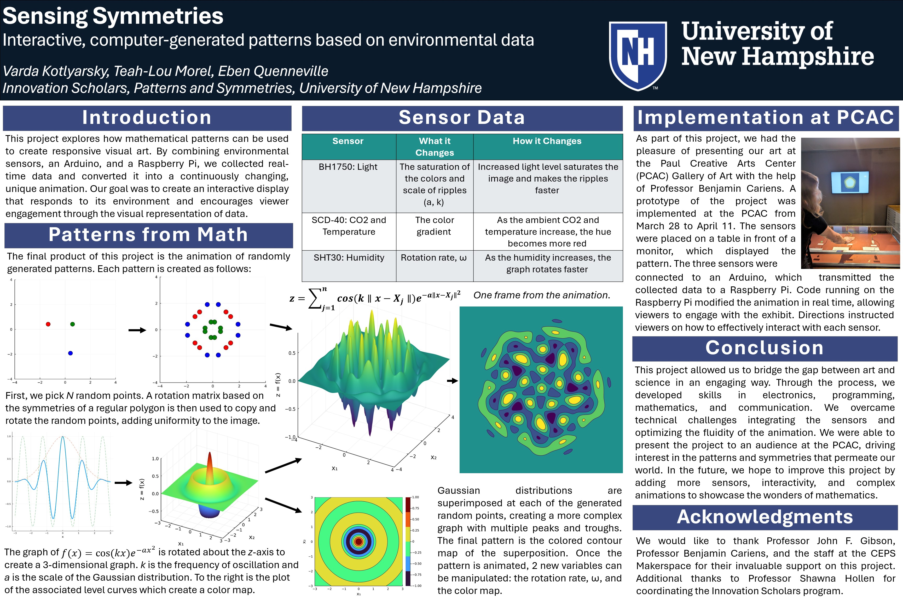

This project explores how mathematical patterns can be used to create responsive visual art. By combining environmental sensors, an Arduino, and a Raspberry Pi, we collected real-time data and converted it into a continuously changing, unique animation. Our goal was to create an interactive display that responds to its environment and encourages viewer engagement through the visual representation of data.​

The project was developed as part of the University of New Hampshire's Innovation Scholars program, which supports interdisciplinary research and creative projects. We presented our work at the 2025 Undergraduate Research Conference at UNH, where it received positive feedback for its innovative approach to blending art and technology. Below is a poster summarizing our project.

